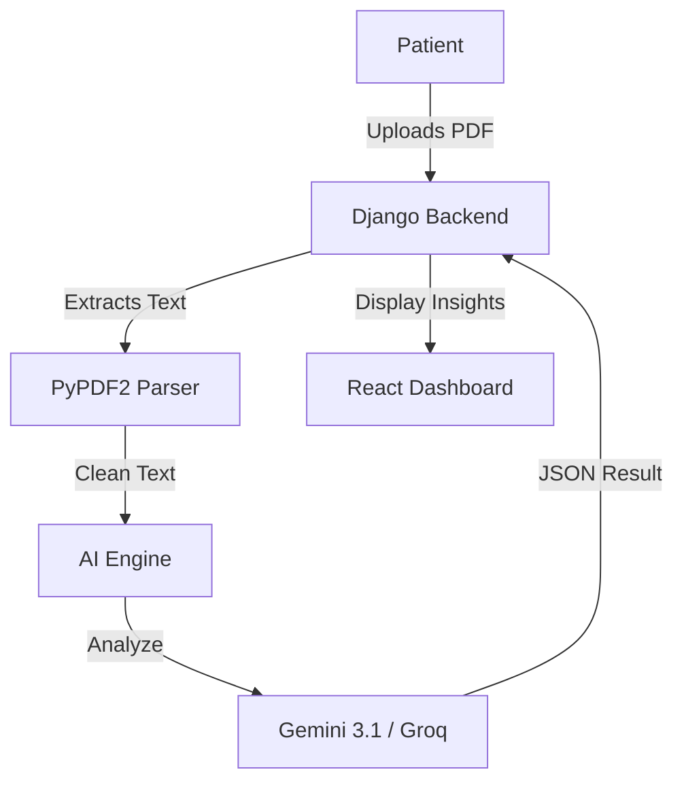

# Health Monitoring System with Aadhaar-Linked Identity 🏥🤖

[](https://www.djangoproject.com/)
[](https://reactjs.org/)
[](https://deepmind.google/technologies/gemini/)
[](https://groq.com/)
[](https://uidai.gov.in/)

A full-stack, state-of-the-art healthcare ecosystem that decentralizes medical records using Aadhaar-based identification and leverages multimodal AI for clinical insights.

---

## 🌟 Key Features

### 🔐 Secure Identity & Authentication
- **Aadhaar-Linked Identity**: Unique health profiles linked to simulated Aadhaar IDs.
- **OTP Verification**: Secure login and registration powered by **Twilio SMS API**.
- **Role-Based Access Control (RBAC)**: Specialized dashboards for **Patients, Doctors, Clinics, Pharmacies, and Admins**.

### 🧠 Intelligent Clinical Insights
- **Multimodal AI Analysis**: Automatically extracts and analyzes text from uploaded **PDF lab reports** and prescriptions using `PyPDF2`.
- **AI Health Summary**: Generates a clinical overview of the patient's history.
- **Disease Risk Prediction**: Predicts risks for **Diabetes, Hypertension, CVD, and CKD** based on vital trends.
- **Robust AI Failover**: Multi-model architecture that automatically switches between **Gemini 3.1, Groq (Llama 3.3), and xAI Grok** to ensure 100% uptime.

### 🛡️ Privacy & Consent Management
- **Consent-Based Sharing**: Doctors can *only* view records if the patient has granted active consent.
- **Audit Logging**: Every access attempt is logged for full clinical accountability.
- **QR Code Identification**: Patients can generate professional QR codes for instant, secure profile lookups by authorized providers.

### 💬 Patient Engagement
- **Cura AI Chatbot**: A 24/7 medical assistant for symptom queries and health advice.
- **Responsive UI**: Fully optimized for Desktop, Tablet, and Mobile devices.

---

## 🛠️ Technology Stack

| Layer | Technology |
|---|---|
| **Frontend** | React.js, Tailwind CSS, Lucide Icons, Recharts (Analytics) |
| **Backend** | Django, Django REST Framework (DRF) |
| **AI Models** | Google Gemini 3.1 Flash, Groq Llama 3.3, xAI Grok-1 |
| **Database** | MySQL / PostgreSQL / SQLite |
| **Third-Party** | Twilio (SMS), PyPDF2 (Document Parsing), JWT (Auth) |

---

## 🚀 Getting Started

### 1. Prerequisites
- Python 3.8+
- Node.js & npm

### 2. Backend Setup
```bash
cd backend
python -m venv venv
source venv/bin/activate  # On Windows use `venv\Scripts\activate`
pip install -r requirements.txt
python manage.py migrate
python manage.py runserver
```

### 3. Frontend Setup
```bash
cd my-react-app
npm install
npm start
```

### 4. Environment Variables
Create a `.env` file in the `backend/` directory:
```env
GEMINI_API_KEY=your_key
GORQ_API_KEY=your_key
GROK_API_KEY=your_key
TWILIO_ACCOUNT_SID=your_sid
TWILIO_AUTH_TOKEN=your_token
TWILIO_PHONE_NUMBER=your_number
```

---

## 📊 System Architecture



---

## 📜 Project Documentation
For a detailed academic breakdown, please refer to the **[Project Report](./project_report.md)** which includes:
- ER Diagrams & DFDs
- Use Case & Sequence Diagrams
- Complete Module Descriptions

---

## 🤝 Contribution
This project was developed as a final year engineering project. Feedback and contributions are welcome!

## ⚖️ License
Distributed under the MIT License. See `LICENSE` for more information.

---
**Disclaimer**: *This system uses Aadhaar numbers as a simulated identity key for educational purposes only. No real government Aadhaar API is integrated.*
